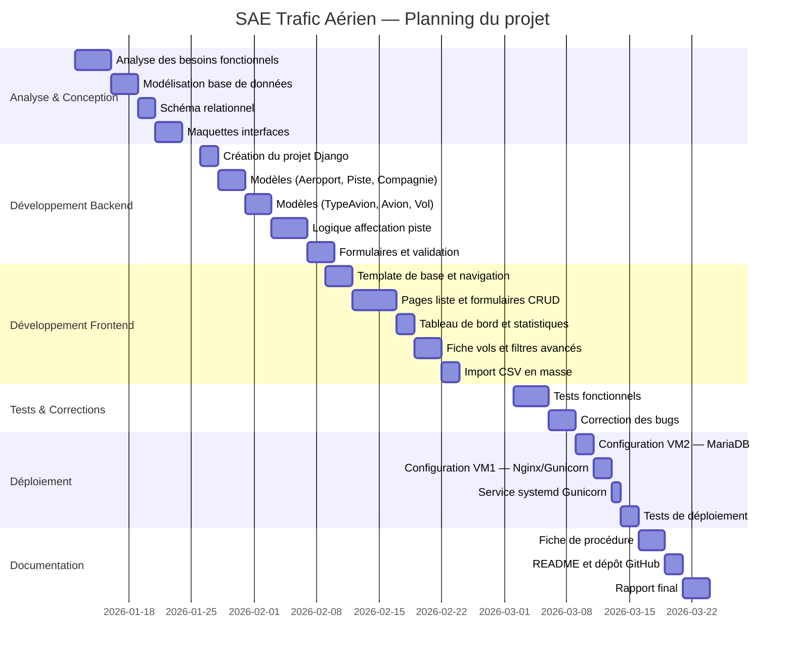

# Diagramme de Gantt — SAE Trafic Aérien

## Résumé du planning

| Phase | Période | Durée |
|---|---|---|
| Analyse & Conception | 12 jan – 23 jan 2026 | 2 semaines |
| Développement Backend | 26 jan – 13 fév 2026 | 3 semaines |
| Développement Frontend | 9 fév – 2 mar 2026 | 3 semaines |
| Tests & Corrections | 2 mar – 6 mar 2026 | 1 semaine |
| Déploiement | 9 mar – 13 mar 2026 | 1 semaine |
| Documentation | 16 mar – 24 mar 2026 | 1,5 semaine |
