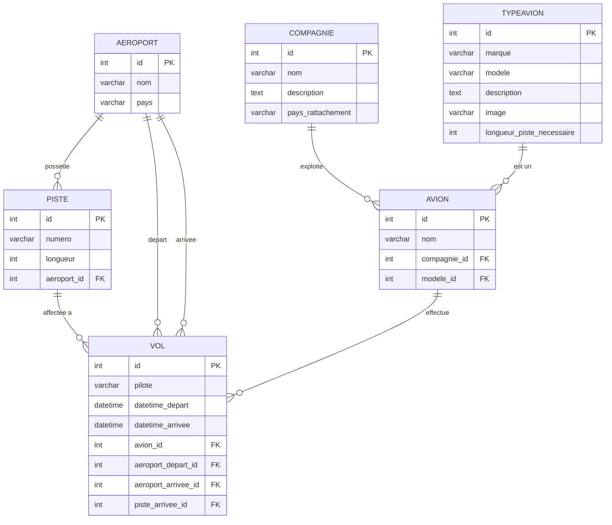

# Schéma Relationnel — SAE Trafic Aérien

## Diagramme Entité-Relation

## Description des tables

### AEROPORT
Représente un aéroport physique. Un aéroport possède plusieurs pistes et peut être aéroport de départ ou d'arrivée pour des vols.

| Champ | Type | Contrainte | Description |
|---|---|---|---|
| id | INT | PK, AUTO_INCREMENT | Identifiant unique |
| nom | VARCHAR(200) | NOT NULL | Nom de l'aéroport |
| pays | VARCHAR(100) | NOT NULL | Pays de l'aéroport |

### PISTE
Représente une piste d'atterrissage/décollage appartenant à un aéroport.

| Champ | Type | Contrainte | Description |
|---|---|---|---|
| id | INT | PK, AUTO_INCREMENT | Identifiant unique |
| numero | VARCHAR(20) | NOT NULL | Numéro de piste (ex: 09L) |
| longueur | INT UNSIGNED | NOT NULL | Longueur en mètres |
| aeroport_id | INT | FK → AEROPORT (CASCADE) | Aéroport propriétaire |

### COMPAGNIE
Représente une compagnie aérienne.

| Champ | Type | Contrainte | Description |
|---|---|---|---|
| id | INT | PK, AUTO_INCREMENT | Identifiant unique |
| nom | VARCHAR(200) | NOT NULL | Nom de la compagnie |
| description | TEXT | — | Description de la compagnie |
| pays_rattachement | VARCHAR(100) | NOT NULL | Pays d'origine |

### TYPEAVION
Représente un modèle d'avion (ex: Boeing 737, Airbus A320).

| Champ | Type | Contrainte | Description |
|---|---|---|---|
| id | INT | PK, AUTO_INCREMENT | Identifiant unique |
| marque | VARCHAR(100) | NOT NULL | Constructeur (Boeing, Airbus…) |
| modele | VARCHAR(100) | NOT NULL | Modèle (737-800, A320…) |
| description | TEXT | — | Description |
| image | VARCHAR(100) | NULL | Chemin vers l'image |
| longueur_piste_necessaire | INT UNSIGNED | NOT NULL | Longueur minimale de piste (m) |

### AVION
Représente un avion réel (immatriculé) appartenant à une compagnie.

| Champ | Type | Contrainte | Description |
|---|---|---|---|
| id | INT | PK, AUTO_INCREMENT | Identifiant unique |
| nom | VARCHAR(200) | NOT NULL | Immatriculation (ex: F-GKXA) |
| compagnie_id | INT | FK → COMPAGNIE (CASCADE) | Compagnie propriétaire |
| modele_id | INT | FK → TYPEAVION (CASCADE) | Type d'avion |

### VOL
Représente un vol entre deux aéroports. La piste d'arrivée est affectée automatiquement.

| Champ | Type | Contrainte | Description |
|---|---|---|---|
| id | INT | PK, AUTO_INCREMENT | Identifiant unique |
| pilote | VARCHAR(200) | NOT NULL | Nom du pilote |
| datetime_depart | DATETIME | NOT NULL | Date et heure de départ |
| datetime_arrivee | DATETIME | NOT NULL | Date et heure d'arrivée |
| avion_id | INT | FK → AVION (CASCADE) | Avion utilisé |
| aeroport_depart_id | INT | FK → AEROPORT (CASCADE) | Aéroport de départ |
| aeroport_arrivee_id | INT | FK → AEROPORT (CASCADE) | Aéroport d'arrivée |
| piste_arrivee_id | INT | FK → PISTE (SET NULL) | Piste affectée à l'arrivée |

## Règles métier

- Une piste est **bloquée ±10 minutes** autour de chaque atterrissage
- La longueur de piste doit être **≥ longueur_piste_necessaire** du type d'avion
- Si aucune piste n'est disponible, le système suggère un décalage de **+15 minutes**
